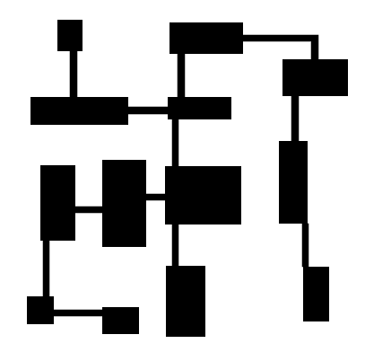
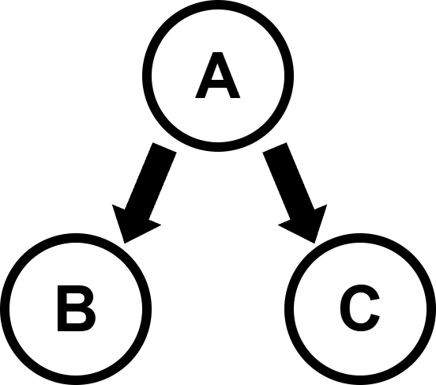
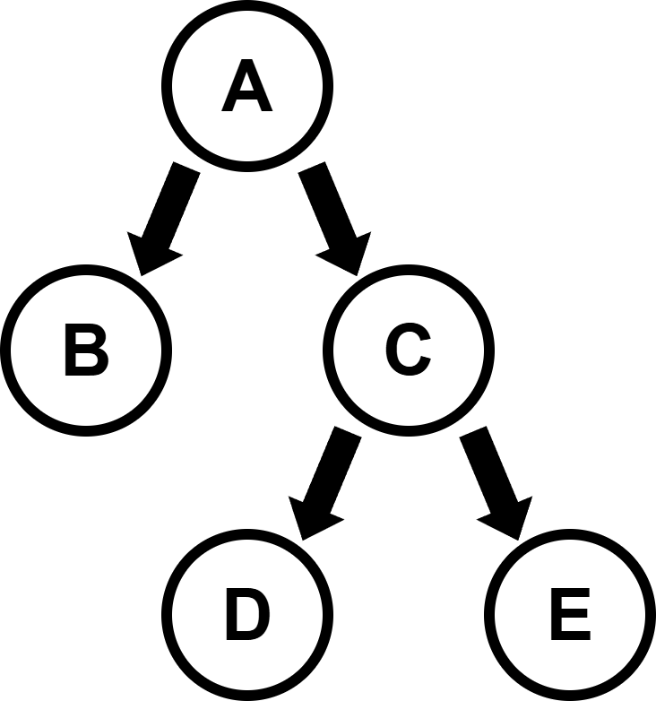
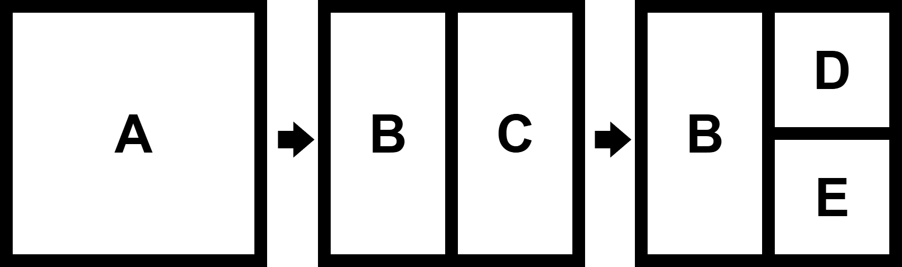
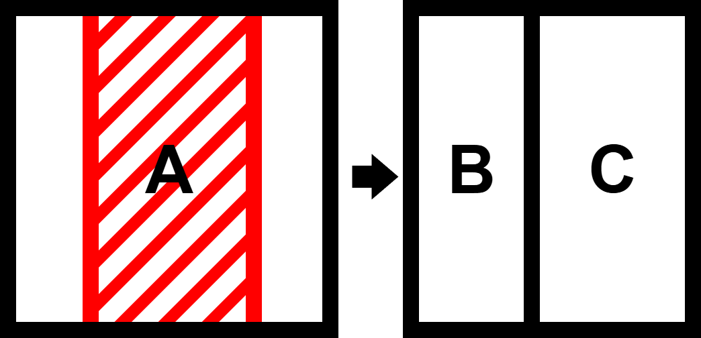
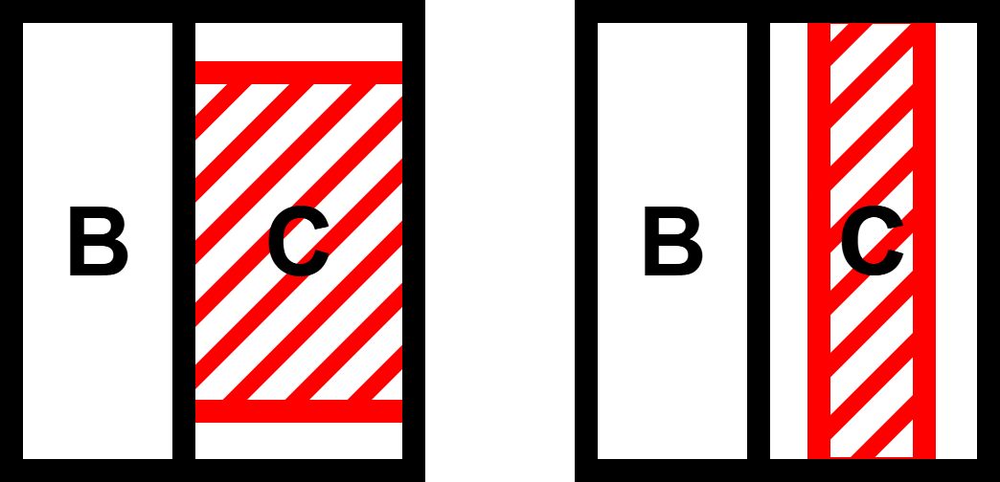
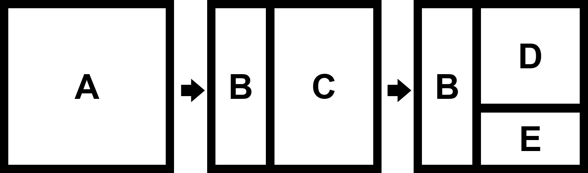
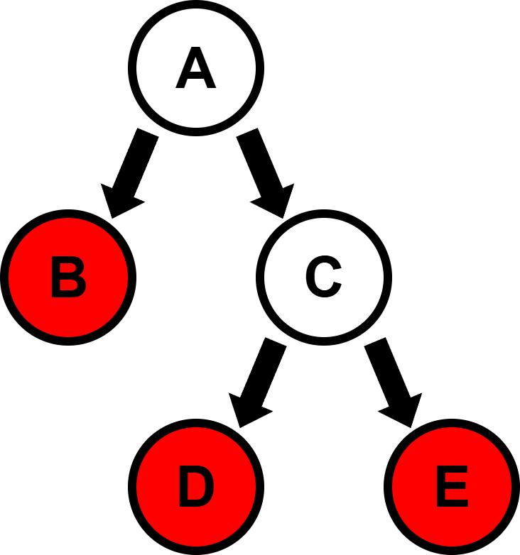
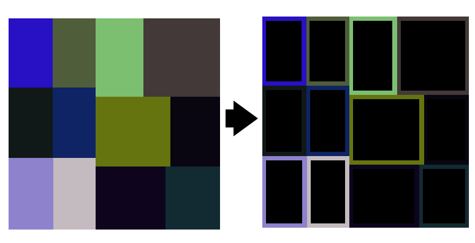
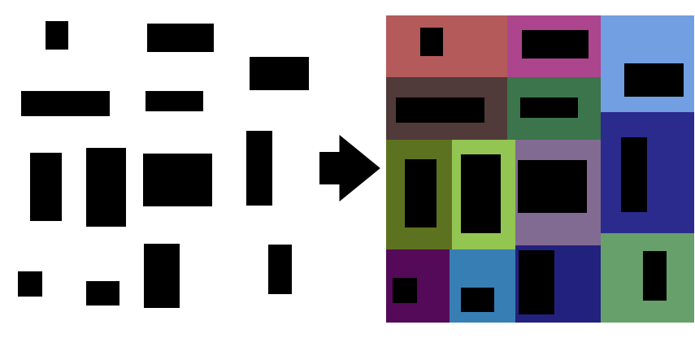

# Binary Space Partitioning (BSP) for Dungeon Generation
## Introduction
In this project, we use Binary Space Partitioning (BSP) to generate a dungeon.

The goal is to explain the generation process step-by-step, starting with what BSP actually is, then showing how we can use it for dungeon generation by either trimming or randomizing room placement and size. Finally, we connect everything together into a fully usable dungeon layout.

## What is BSP
Binary Space Partitioning also called BSP is a method used to divide a 2D or 3D space into smaller regions. It is used in computer graphics and game development to make rendering scenes and handling collisions more efficient.

A single BSP split divides a space into two new regions.
 

Each split can also be displayed as a node. Every node stores references to a left/right child.

This process you keep recursively doing until the desired outcome is reached, resulting in a structure known as a **BSP Tree**.

### Why would we use this
BSP becomes useful for dungeon generation when we combine it with constraints and randomness.
For example, we can define a minimum room size. Instead of splitting exactly in the middle, we split randomly while still respecting these minimum dimensions.

We can also randomize the split direction between horizontal and vertical cuts

By recursively repeating this process, we eventually create a randomized grid layout.

But now that we have a grid like structure we can also see the ends of the tree.
We call these Leaf nodes, they are the smallest possible cuts using our constraints.

## Implementation
Now that we have a randomized grid structure, we can use it to create a dungeon.
There are two possible approaches.
- Trimming (Simple but stiff)
- Randomizing Room Size and placement (more natural)
### Trimming
With this method we shrink each leaf node slightly by trimming its borders.

After that, we go through our BSP tree and connect all the leaf nodes with corridors. creating a clean and structured dungeon layout.

### Randomize
To create a more natural-looking dungeon, in our leaf nodes we can randomize both the size and position of the room while staying within the constraint of the node.
First we shrink each room by a random amount

Next, we reposition the room within its node bounds.

Repeat this process for every leaf node.

Connecting these randomized rooms becomes more difficult because rooms are no longer aligned perfectly.

Simple straight horizontal or vertical corridors are often no longer sufficient.
To solve this, we introduce **L-shaped corridors**.

Using these new shaped corridors we create a more organic dungeon layout.

## Result
Using BSP, we can generate two different dungeon styles:
- A simple trimmed layout with structured rooms
- A randomized layout with more natural room variation
Both approaches create a connected and usable procedural dungeon.

## Conclusion
This implementation demonstrates how an algorithm originally designed for rendering/collision optimization can be repurposed for procedural dungeon generation.

By recursively subdividing space and applying controlled randomness, BSP provides a reliable way to create structured yet varied dungeon layouts.

Possible future improvements include:
- Corridors not overlapping rooms
- Room type randomization
- Combine it with other algorithms to generate an even better dungeons

## References
- [Wikipedia - Binary Space Partitioning](https://en.wikipedia.org/wiki/Binary_space_partitioning#Overview)
- [GeeksForGeeks - Binary Space Partitioning](https://www.geeksforgeeks.org/dsa/binary-space-partitioning/)
- [Medium - Dungeon Generation using BSP Trees](https://medium.com/@guribemontero/dungeon-generation-using-binary-space-trees-47d4a668e2d0)
- [Rogue Basin - Basic BSP Dungeon Generation](https://www.roguebasin.com/index.php/Basic_BSP_Dungeon_generation)
- [Research Gate - Procedural Dungeon Generation](https://www.researchgate.net/publication/353921862_Procedural_Dungeon_Generation_A_Survey) 